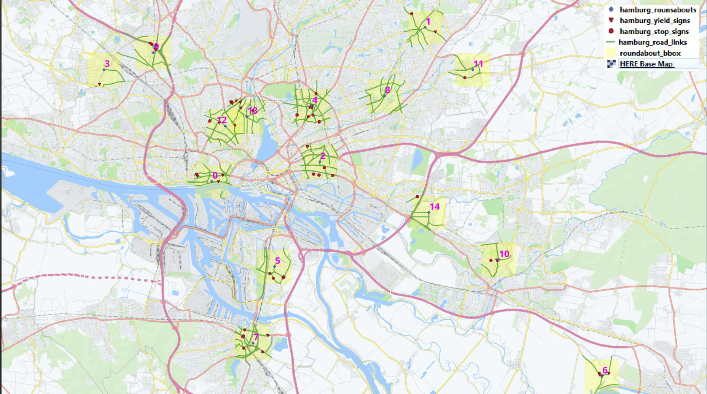
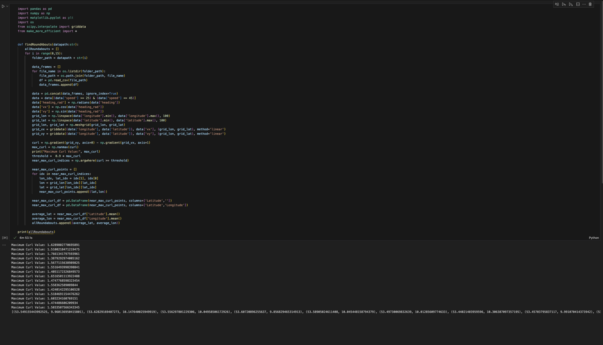

# roundabout-here-hackathon
## Presentation Link: https://docs.google.com/presentation/d/1XpDzvA97Vfw6EgN17d3P5xkSsrcsIVDOrJwLEtaNCNk/edit?usp=sharing 

# HERE Chicago Hackathon: Team KodeKweens 

## Project Overview 
This project aims to develop a model to identify roundabouts in road networks using probe data. The primary focus will be on creating a solution that can detect roundabouts in the city of Hamburg, extracting meaningful patterns from data containing noise and gaps. Our goal is to achieve high accuracy while tackling real-world challenges associated with sparse or incomplete data.


## Expectations 
1. **Identify Roundabouts from Probe Data**
2. **Handle Noise and Data Gaps**
3. **Achieve High Accuracy in Hamburg**

### Installation
1. **Clone the repository**
2. **Install dependencies:**
   ```bash
   pip install pandas numpy matplotlib scipy
   ```

### Usage
1. **Download probe data**
2. **Run the application:**
   ```bash
   py curl.py
   ```


## Pitch
This project uses probe data (including speed, heading, latitude, and longitude) to analyze and detect roundabouts in road networks. By leveraging vector fields and computing key metrics like curl, the model provides insights into traffic patterns, highlighting areas of rotational movement characteristic of roundabouts. 

### Features and Approach
Data Loading and Preprocessing: Load GPS probe data from CSV files containing speed, heading, latitude, and longitude. Filter data to focus on speed ranges typical for roundabouts (between 25 and 45 mph). Convert heading information from degrees to radians for vector analysis.

Vector Field Creation: Calculate velocity components (vx and vy) from heading data. Interpolate the velocity components onto a finer grid for higher resolution analysis.

Curl Calculations: Compute 2D curl to identify rotational movements, which are key indicators of roundabouts.
